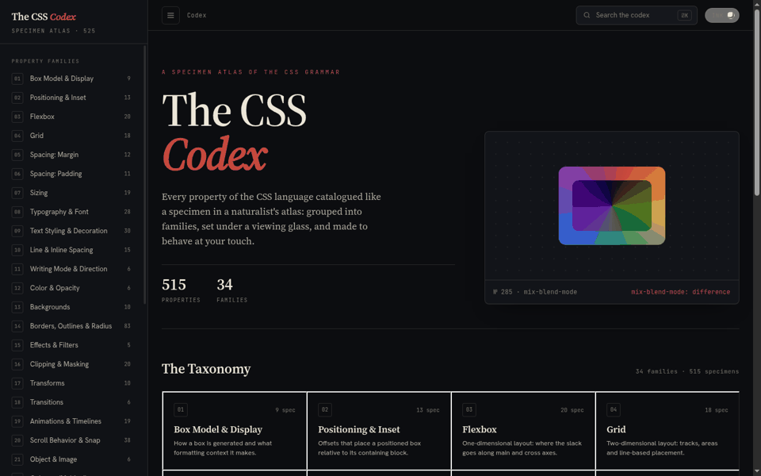

# Deploying & validating The CSS Codex

The gallery is a **fully static site**. `chrome-testing/dist.sh` assembles a
self-contained bundle in `chrome-testing/dist/` (HTML, JSX, styles, generated
grammar data with paths rewritten, image/font assets, and vendored production
React + Babel), which can be dropped on any static host.

This doc covers the reproducible path used for the live demo at
**https://css-demo.pages.dev** — deploy to Cloudflare Pages, then validate the
running site by driving a real browser through a representative user journey.

```
dist.sh ──► dist/ ──deploy.sh──► Cloudflare Pages ──validate-deploy.sh──► ✅ journey
            (static)             (css-demo.pages.dev)   (chromerpc bidi pool)
```

`deploy.sh` and `validate-deploy.sh` are standalone scripts (not wired into
`LET_IT_RIP.sh`). The validation drives a real browser through the journey below
and saves it as **`chrome-testing/journey.gif`** (committed):



## Prerequisites

| Tool | Used for |
|---|---|
| `wrangler` | Cloudflare Pages asset upload (`npm i -g wrangler`) |
| `go` | build proto-cloudflare `serverd` and chromerpc `chrome-proxy` |
| `grpcurl` | call the proto-cloudflare gRPC API (`go install github.com/fullstorydev/grpcurl/cmd/grpcurl@latest`) |
| `gcloud` | identity token for the chromerpc Cloud Run pool |
| checkouts | `accretional/proto-cloudflare` (optional, for gRPC project create) and `accretional/chromerpc` (for validation) |

**Secrets never live in the repo.** Tokens are read from the environment; the
scripts fail fast if they're unset.

## 1. Build the bundle

```bash
./chrome-testing/gen.sh          # regenerates data AND builds dist/ (via dist.sh)
# or just the bundle, if the data is current:
./chrome-testing/dist.sh
```

Preview locally exactly what deploys:

```bash
./chrome-testing/serve.sh        # serves dist/ at http://localhost:8888/
```

## 2. Deploy to Cloudflare Pages — `deploy.sh`

The deploy is **two parts** (discovered by reflecting on proto-cloudflare):

1. **Project creation** → `proto-cloudflare`'s gRPC `cloudflare.pages.PagesProjectService.PagesProjectCreateProject`.
2. **Asset upload** → `wrangler`. Cloudflare Pages *direct upload* needs the
   blake3-hashed file manifest + JWT asset-upload flow, which proto-cloudflare's
   generated REST wrapper does **not** expose (its `CreateDeployment` takes only a
   `manifest` string, no file bytes and no asset-upload service). wrangler
   implements that flow natively, so it does the upload.

```bash
export CLOUDFLARE_API_TOKEN=…           # a Pages-edit-scoped Cloudflare API token
export CLOUDFLARE_ACCOUNT_ID=…          # see: wrangler whoami
export PROTO_CLOUDFLARE_DIR=~/Documents/proto-cloudflare   # optional: gRPC project create
# CF_PAGES_PROJECT=css-demo  CF_PAGES_BRANCH=main          # optional overrides

./chrome-testing/deploy.sh
```

- With `PROTO_CLOUDFLARE_DIR` set, the script builds + runs `serverd` (passing the
  token via the environment — no secret written to disk), creates the project over
  gRPC (tolerating "already exists"), then shuts it down.
- Without it, `wrangler` creates the project on first deploy.
- Output: `https://<project>.pages.dev/`.

> **Tokens used for the live demo:** a Cloudflare Pages-scoped API token for both
> proto-cloudflare and wrangler. Create one at *Cloudflare dashboard → My Profile
> → API Tokens → Create Token → "Cloudflare Pages: Edit"*.

## 3. Validate the deployed site — `validate-deploy.sh`

Drives a real headless browser from the **chromerpc bidi pool** (a Cloud Run gRPC
service) through the journey: **load home → search a property → open it → scroll →
open the Grammar drawer → Copy the live CSS**. A gRPC bidi stream is one
long-lived connection; the chromerpc repo's **`chrome-proxy`** holds it open and
fronts it with `POST /steps`, so the script can drive one live session across
discrete requests. The assembled **`chrome-testing/journey.gif`** is the
committed artifact (override with `GIF_OUT`).

```bash
gcloud auth login                       # once; the script uses an identity token
export CHROMERPC_DIR=~/Documents/chromerpc
# DEPLOY_URL=https://css-demo.pages.dev  SEARCH_PROP=clip-path  (optional overrides)

./chrome-testing/validate-deploy.sh
```

Each of the 6 phases asserts success (e.g. `window.CODEX` loaded, the search
result appears, the route changed to `#/p/…`, the Grammar drawer opened, the
"Copied to clipboard" toast fired) and saves a screenshot. A non-zero exit means
a phase failed.

The pool endpoint defaults to
`chromerpc-bidi-pool-873306079214.us-central1.run.app:443`; override with
`CHROMERPC_POOL`. Auth is a Google identity token (`gcloud auth print-identity-token`).

## Notes

- `dist/`, `_deploy-shots/`, and `.vendor-cache/` are gitignored build/run artifacts.
- The bundle vendors React/Babel locally; the only runtime CDN reference is Google
  Fonts for the UI typefaces (specimen fonts are local). `VENDOR_OFFLINE=0
  ./chrome-testing/dist.sh` keeps React/Babel on the CDN instead.
- Re-running `deploy.sh` publishes a new immutable deployment and updates the
  production alias; `validate-deploy.sh` is read-only against the live site.
